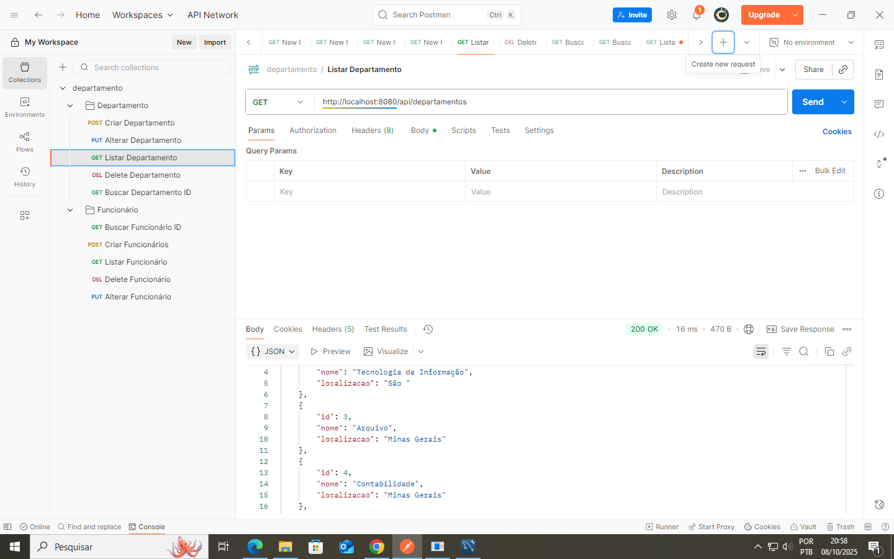
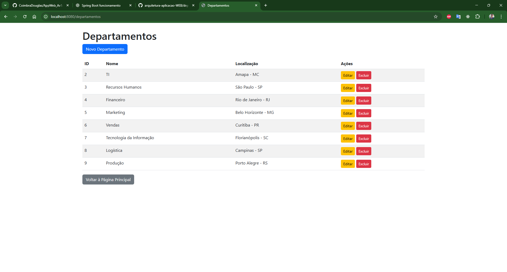
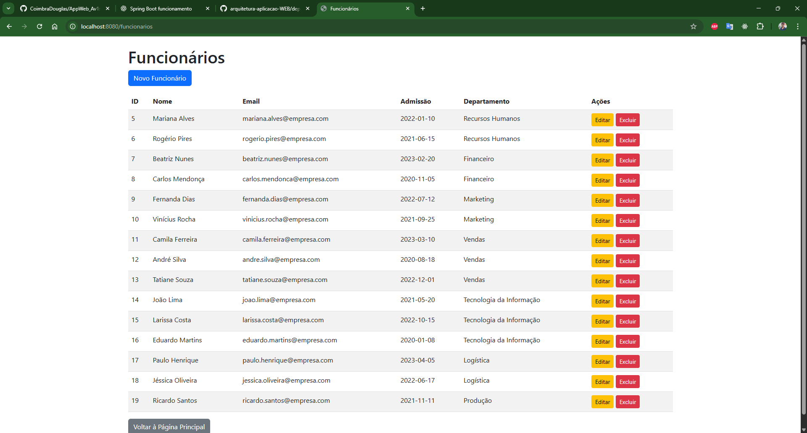
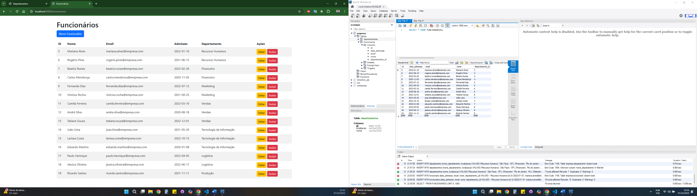

# 🏢 Sistema de Gestão de Funcionários e Departamentos

## 📖 Descrição do Projeto
Este projeto foi desenvolvido em **Spring Boot** e tem como objetivo realizar o **cadastro e gerenciamento de funcionários e departamentos**.  
A aplicação permite cadastrar, listar, atualizar e excluir registros de forma prática, utilizando uma interface web integrada ao banco de dados MySQL.

## ⚙️ Tecnologias Utilizadas
- **Java 17**
- **Spring Boot**
- **Spring Data JPA**
- **MySQL**
- **Thymeleaf**
- **Bootstrap**
- **Maven**

## 🚀 Funcionalidades
- Cadastro de Departamentos  
- Cadastro de Funcionários  
- Associação de Funcionários a Departamentos  
- Visualização de todos os registros cadastrados  
- Navegação entre as páginas (home, funcionários e departamentos)  

## 📂 Estrutura do Projeto


src/
├── main/
│ ├── java/
│ │ └── com.exemplo.empresa/
│ │ ├── controller/
│ │ ├── model/
│ │ ├── repository/
│ │ └── EmpresaApplication.java
│ └── resources/
│ ├── templates/
│ │ ├── index.html
│ │ ├── funcionarios.html
│ │ └── departamentos.html
│ └── application.properties


## 🖼️ Exemplo da Interface
  
``

## 🧠 Como Executar o Projeto
1. **Clone o repositório:**
   ```bash
   git clone https://github.com/thiago-deones/arquitetura-aplicacao-WEB/tree/main/departamento

2. **Abra o projeto no IntelliJ ou VS Code com suporte a Java.**

3. **Configure o banco de dados MySQL:**

create database empresa;

4. **Atualize o arquivo application.properties:**

spring.datasource.url=jdbc:mysql://localhost:3306/empresa
spring.datasource.username=root
spring.datasource.password=
spring.jpa.hibernate.ddl-auto=update


5. **Execute o projeto:**

mvn spring-boot:run


6. **Acesse no navegador:**

http://localhost:8080/

🧭 Navegação

Página Inicial: /

Departamentos: /departamentos

Funcionários: /funcionarios

Cada página possui um botão para retornar à página inicial.

---

## 📸 Imagens do Projeto

A seguir estão algumas telas do sistema em execução.  
*(Basta substituir os campos abaixo pelos caminhos das suas imagens — por exemplo: `./imagens/postman.png` ou `https://link.com/imagem.png`)*

### 🧰 1. Testes de API no Postman
Demonstração dos endpoints funcionando corretamente para **Departamentos** e **Funcionários**.



---

### 🏢 2. Tela de Lista de Departamentos
Visualização dos departamentos cadastrados, com botões de **editar** e **excluir**.



---

### 👩‍💼 3. Tela de Lista de Funcionários
Visualização de todos os funcionários, mostrando **nome, e-mail, data de admissão e departamento**.



---

### ➕ 4. Tela de Cadastro de Funcionário
Formulário para **adicionar ou editar** um funcionário, com seleção de departamento no menu dropdown.



---

